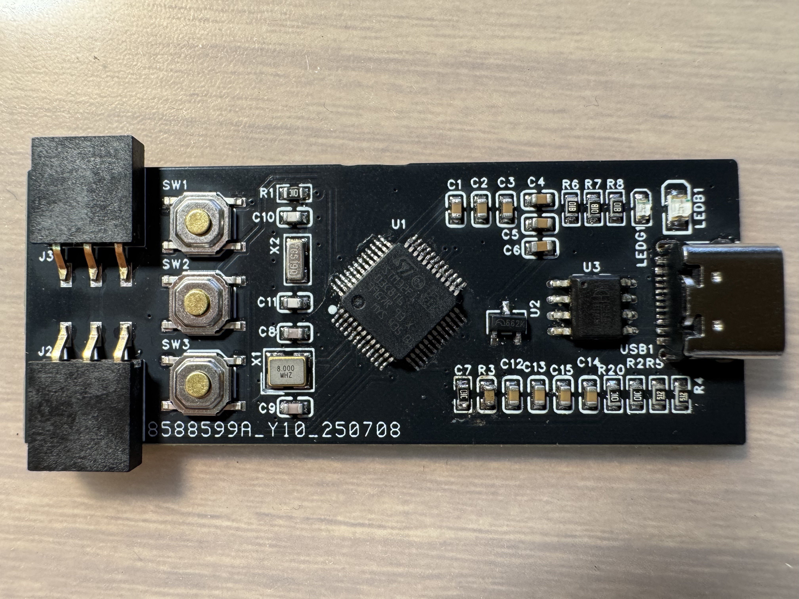
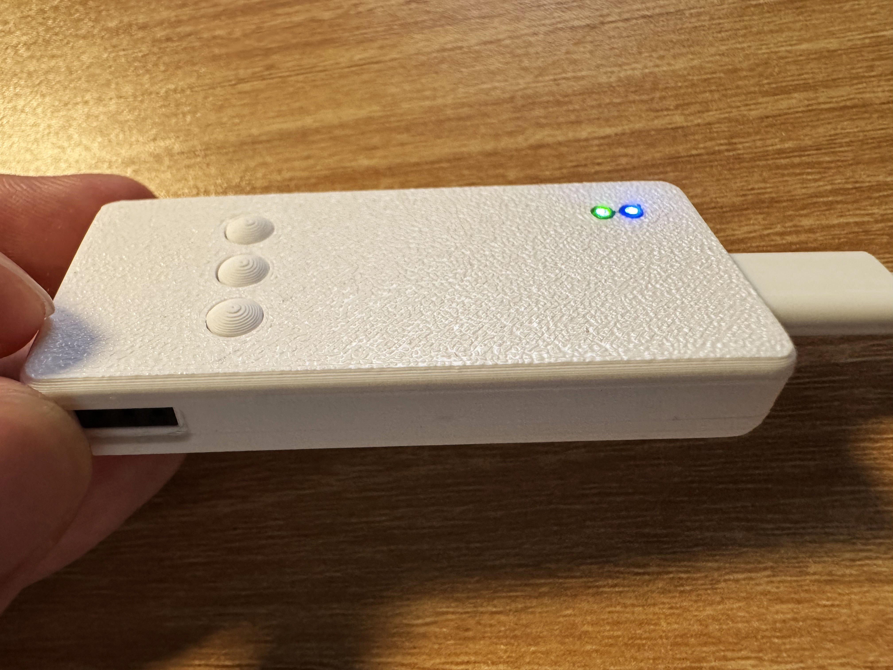

# 串口透镜

一个小站点，串联在usart串口通信线路上，不干扰原始的通信，查看通信信息。

我不仅希望这个项目的成品能够成为开发调试的实用工具，也希望在项目制作中引入一些富有挑战性的内容。

### 概念构思

一个小长方盒，两端是通信接口，用于串联在原始通信线路上；上面是一块屏幕，实时显示通信内容；侧面有一个接口，可以连接电脑，发送监听到的信息；附加一些其他的小按钮，方便调试使用。

### 硬件设计

- #### 主控芯片

    选用STM32F103C8T6芯片作为数据监听与输出控制器，刚好有3个usart外设，两个的rx用于监听两根通信线，第三个用于和电脑通信。

    > 这一部分涉及基础的串口通信内容，没有过多的新鲜性，唯一有意思的是这次的接收实际上是窃听，属于通信中的第三者。我决定这个项目不再采用开发板搭建，而是直接自己绘制并焊接芯片外围电路。

- #### 屏幕

    本来打算用串口屏，但是我希望整个装置可以由电池独立供电，串口屏可能功耗偏高了，作为基础的文字显示需求使用裸屏即可。

    > 像素屏显示文字也是老技能了，这里也没有其他过多的需求。

- #### 电源

    采用可充电锂电池

    > 电源是所有电子系统的基础组成部分，电源的输出一般不会满足系统的需求，往往需要转换，这也是我一直十分头疼的问题。我为电赛绘制的电源模块使用的是隔离电源模块，这是我苦苦搜寻找到的最无脑也是效果最让我满意的模块，但是用在这个项目里显然不合适，我不得不再次直面低压电源转换这个问题。除此之外，还有充电电路的设计，希望网上的资源足够稳健。这也算是补全一块经验了。

- #### 主机通信

    我希望足够简单，最好是能牵一根USB线就能通信，这就需要芯片的外围电路上集成串口转USB电路，最好这个接口把充电的功能也包了。

    > C8T6 和 CH340 的原理图应该不难找，这回的电路设计有的整了。

- #### 其他附加功能

    我目前想到的一个就是不用区分两个通信线是rx还是tx，要是接反了，通过一个机械开关一键反接回来；另外要支持待机和唤醒，这个大多数MCU都有，甚至一些小芯片也有这个功能（我见过外挂的ADC采集芯片支持休眠和唤醒的）

    > 反接就是一个双刀双掷开关吧，待机需要研究一下，没怎么用过。

### 软件设计

这个没什么难度了，收发数据和显示罢了。

不过既然能和电脑连接通信，那么我的传统艺能，一个好看好用的上位机软件自然是少不了了。与电脑通信的主要目的是解决小屏幕显示信息量有限的问题。

### 外壳设计

方正小巧、舒适圆角、简约外观、3D打印。

## 25.7.7更新

第一轮设计与测试已经结束了，结果是失败的（最小系统并没有正常运行），由于第一步迈得太大了，导致我不知道是哪个环节出了问题，我一共焊了两块板子，都失败了，应该排除了焊接因素，问题主要出在电路设计上。目前的测试结果为：STlink能够识别设备，但是第一次下载了程序以后就不能下载了（我印象中第一次下载是成功了的，反正后面是下不进去），然后测试外挂晶振都没有起振（不清楚是不是探针太粗了压根没测到），供电上可能存在几处短路或设计缺陷（上电后出现引脚处冒烟现象），电源相关模块里有一个东西比较烫，摆得比较密，摸不出来是哪一个元件在发热。总之这一版问题还是比较大。

由此我决定，分阶段设计制作，首先制作一个简化版，在此基础上拓展成为最初设想的完全体。

简化版抛弃 屏幕、电池、SWD调试功能，通过串口下载程序，通过上位机显示数据，通过USB供电。

## 25.7.18更新

电赛备赛时忙里偷闲搞定了简化版的硬件设计与焊接，我保留了一个可编程控制的指示灯和可编程响应的按钮，简单写了个闪烁LED测试程序，运行没问题。这版方案省去了SWD接口，通过串口下载程序，正常运行时这个串口就用来和主机通讯。由于没有配备屏幕，所以这个方案必须搭配上位机使用，上位机写了个小开头，后面再说吧。

不过这个简化版的 PCB Layout 我倒是很满意，比之前的完整版要好看很多，完整版的东西太多了，我又为了使用回流焊，将所有元件都布置在正面，要改变这一点，要么使用高多层板，简化布线压力；要么换用更小的贴片封装，但是我目前的元件存货都是0603封装的，估计不好改封装。

画PCB的时候C7和R3的丝印位置放反了，测试的时候才发现一直处在复位状态，两个元件实际的位置跟着外框来，不要跟着丝印的位置焊；另外，电源指示灯（绿色LED）的限流电阻设定的是1kΩ，我觉得有点亮改成4.7kΩ了，程控指示灯是蓝色led，最早的完整版方案测试时觉得1kΩ亮度不够，这里用了2个1kΩ并联，因为我没有500Ω的电阻，感觉亮度还行了。

3D外壳的初版方案，打印出来测试尺寸没问题，但是上下盖合不上，因为我外壳给的太薄了，连接柱直接断了，等有时间了再打印一个新版本。

新版外壳也好了，稍微有点瑕疵，可以再微调一下，不过这看起来还真像那么回事。

三个按键自上而下依次是 `Boot` 用于进入串口下载程序，`Reset` 一键重启，`Func` 由程序自定义行为。

单片机只会在上电或重启时确定进入主程序还是串口下载程序，因此按住 `Boot` 键再按下 `Reset`，这时就会进入串口下载程序（之后可以放开 `Boot` 键），这时可以下载程序，松开 `Boot` 时再次重启即可进入主程序。

## 25.7.22更新

这两天把玩时发现目前的外壳设计的一些缺陷：

- 上下盖拼合处会漏光
- 连接柱易断裂，连接不稳固，容易摔开，摔断之后重新打了一个优化过的外壳，之后又摔了一次又断了
